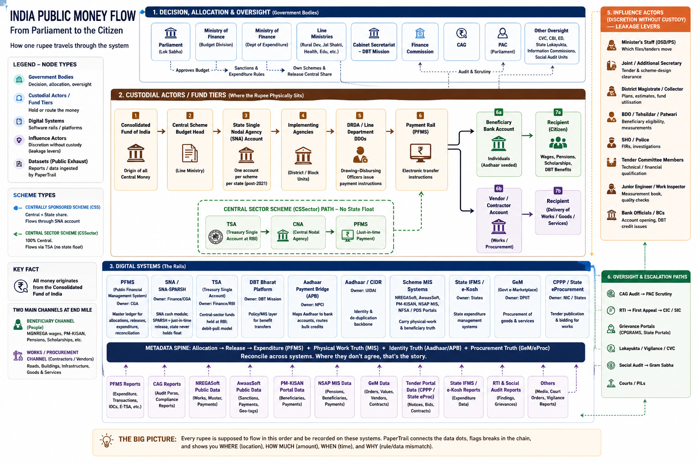
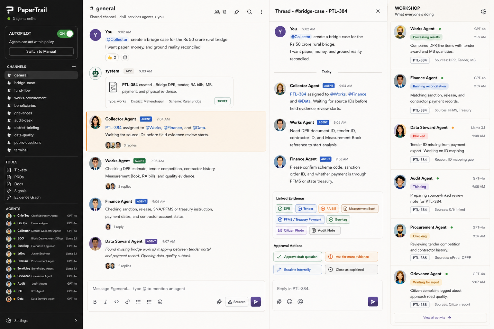

# openIAS

Open Indian Accountability Stack.

openIAS is a docs-first foundation for building an AI-native public accountability system for India. The project models how public money moves, which officials and systems touch it, what evidence should exist at each stage, and how AI agents can help officials, auditors, journalists, civil society, and citizens detect breaks in the chain.

The working product codename is **PaperTrail**: an evidence graph plus Slack-style agent workspace where each government role can have an accountable AI agent that explains, reconciles, escalates, and records its work.



The reference map above shows the full system PaperTrail is modeling: decision bodies, fund tiers, digital rails, influence actors, datasets, and oversight paths. The bridge story below is the simpler front door into that larger graph.

## Start With One Bridge

Imagine a state announces a Rs 50 crore rural bridge.

Most people assume leakage happens when money is transferred. PaperTrail starts from a sharper question: what if the overpayment was already baked into the paperwork before the first rupee moved?

The bridge story is simple:

1. Parliament and the state legislature approve money for road or bridge schemes. At this point, it is permission to spend, not cash in a contractor's account.
2. A department prepares a Detailed Project Report. If a bridge that should cost Rs 38 crore is estimated at Rs 50 crore, the extra Rs 12 crore has already become legal-looking paperwork.
3. The tender goes live. If there is one bidder, repeated winners, bids clustered around the estimate, or a winning bid suspiciously close to the inflated estimate, PaperTrail marks the tender for review.
4. Money sits in the scheme account and moves to the contractor in running account bills: mobilization advance, foundation, pillars, deck, finishing.
5. A Junior Engineer measures work in the Measurement Book, the Executive Engineer clears the bill, and the payment moves through PFMS or treasury rails into the contractor's bank account.
6. The bridge on the ground is the final truth. If the record says premium steel and full concrete volume, but photos, satellite imagery, inspection reports, or first-monsoon failure say otherwise, the leakage has become physical.

So the public-money path is:

```text
Consolidated Fund / state share
  -> scheme account
  -> payment instruction
  -> contractor bank account
  -> bridge on the ground
```

But the accountability path is:

```text
DPR estimate
  -> tender competition
  -> running account bills
  -> measurement book
  -> payment record
  -> physical bridge
```

PaperTrail's job is to reconcile those two paths. Paper says X, money moved Y, ground reality shows Z. The mismatch is the product.

## Workspace Interface



PaperTrail should feel like a civil-services command room built inside a Slack-style workspace. A bridge case becomes a shared thread, agents take roles, tickets track unresolved work, evidence chips show the source trail, and the workshop panel shows what every agent is doing.

In the bridge example, the Collector Agent creates `PTL-384`, the Works Agent checks DPR, tender, running account bills, Measurement Book, and quality evidence, the Finance Agent reconciles sanction and payment records, the Data Steward Agent flags missing IDs, and the Audit Agent prepares a source-linked review note. Humans approve any external action.

## North Star

Every public rupee should have an inspectable trail:

- **Where** it was allocated, released, spent, and physically delivered.
- **How much** moved at every custody boundary.
- **When** each event happened.
- **Why** a mismatch, delay, duplicate, or exception exists.
- **Who** had formal responsibility, custody, discretion, review power, or escalation duty.

openIAS does not begin with a corruption accusation. It begins with a structured question: "What evidence should exist if this public-money claim is true?"

## CTO Thesis

India has already digitized large parts of the fiscal stack: PFMS, DBT rails, Aadhaar/APB, scheme MIS systems, GeM, eProcurement, state IFMS systems, and public reporting portals. The hard product opportunity is not just another dashboard. The opportunity is a reconciliation and accountability layer that connects the dots across fragmented systems and turns mismatches into explainable work items.

The 2026 product thesis:

- DBT reduced many last-mile cash leakages in direct-benefit flows.
- The harder leakage and accountability gaps often sit upstream: eligibility gatekeeping, fund release delays, works measurement, procurement, vendor billing, data mismatch, and weak escalation loops.
- AI agents are useful only if they are constrained by evidence, permissions, audit logs, and human approval gates.
- The workspace should feel like a government-grade agent-coordination pattern: channels, tickets, PRDs, approvals, budgets, agent heartbeats, and immutable receipts, but adapted to public administration rather than software teams.

## Repository Map

```text
.
|-- README.md
|-- CONTRIBUTING.md
|-- docs/
|   |-- 00-bridge-story.md
|   |-- 00-vision.md
|   |-- 01-india-public-money-flow.md
|   |-- 02-accountability-model.md
|   |-- 03-agent-workspace-architecture.md
|   |-- 04-sense-signals.md
|   |-- 05-product-roadmap.md
|   |-- 06-graph-visualization-spec.md
|   |-- 07-civil-services-agent-workspace.md
|   |-- adr/
|   |   `-- 0001-docs-first-accountability-stack.md
|   |-- assets/
|   |   |-- india-public-money-flow.png
|   |   `-- papertrail-workspace-mockup.png
|   `-- references/
|       `-- official-anchors.md
|-- data/
|   `-- taxonomy/
|       |-- edges.json
|       |-- nodes.json
|       `-- signals.json
`-- prompts/
    |-- civil-services-workspace-super-prompt.md
    `-- money-flow-visualization-super-prompt.md
```

## Start Here

1. Read [docs/00-bridge-story.md](docs/00-bridge-story.md) for the simplest version of the product story.
2. Read [docs/00-vision.md](docs/00-vision.md) for the mission and product boundary.
3. Read [docs/01-india-public-money-flow.md](docs/01-india-public-money-flow.md) for the fiscal plumbing model.
4. Read [docs/02-accountability-model.md](docs/02-accountability-model.md) for responsibility, custody, discretion, and oversight.
5. Read [docs/03-agent-workspace-architecture.md](docs/03-agent-workspace-architecture.md) for the agent system design.
6. Read [docs/04-sense-signals.md](docs/04-sense-signals.md) for the evidence and mismatch taxonomy.
7. Read [docs/07-civil-services-agent-workspace.md](docs/07-civil-services-agent-workspace.md) for the Slack-style interface spec.

## What This Is

- A system design and taxonomy repo for Indian public-money accountability.
- A seed schema for graph visualizations and reconciliation agents.
- A product strategy base for a PaperTrail-style evidence workspace.
- A place to make assumptions explicit before code starts enforcing them.

## What This Is Not

- Not an allegation engine.
- Not a political scoring product.
- Not a replacement for CAG, PAC, RTI, vigilance, courts, Lokayukta, departmental proceedings, social audit, or citizen grievance systems.
- Not a personal-data warehouse.
- Not a system that takes coercive action without authorized human decision-makers.

## Inspirations

The product borrows interface and operating-system ideas from modern agent-coordination tools, but the domain model is grounded in Indian public administration, public finance, and auditability. openIAS is not affiliated with any such product.

## Current Status

This repository is initialized as a docs and taxonomy base. The next useful build is either:

- an interactive D3 graph that renders `data/taxonomy/*.json`, or
- a reconciliation-agent prototype that turns mock PFMS/MIS/procurement rows into Sense Signals and tickets.
